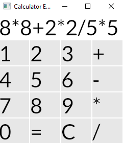
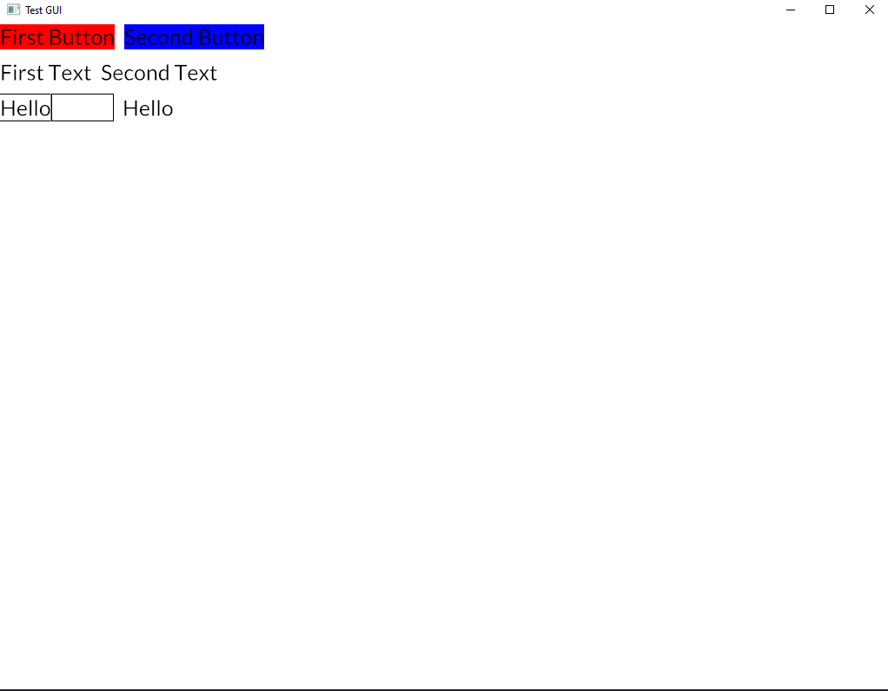
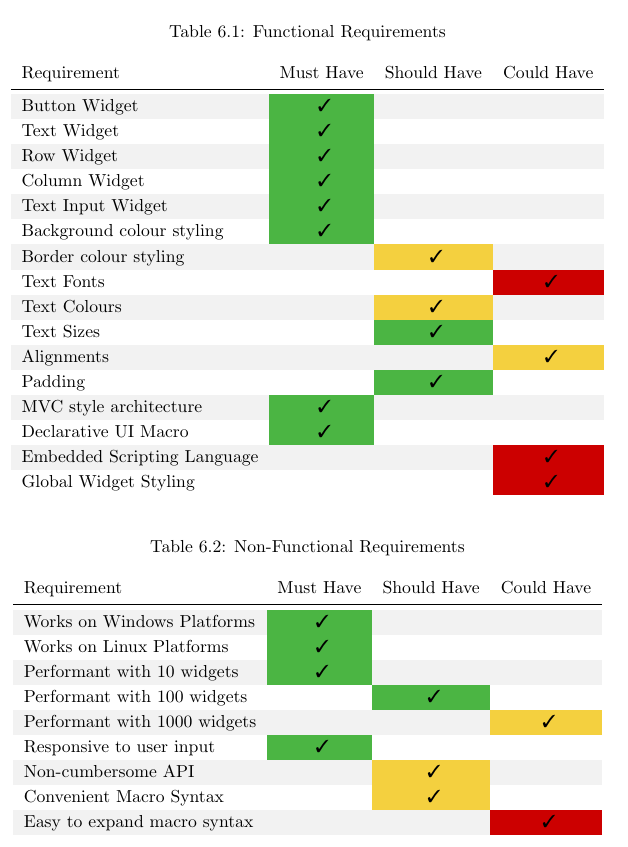

# RL-GUI (Final Year Computer Science Project)

A GUI written in Rust for my Digital Systems Project module at university. It uses an Elm-style MVVM architecture and
has support for some extremely basic widgets currently. It is intended to have an embedded scripting language such as Lua
for easy editing but that is currently under investigation.

 

## Current State

